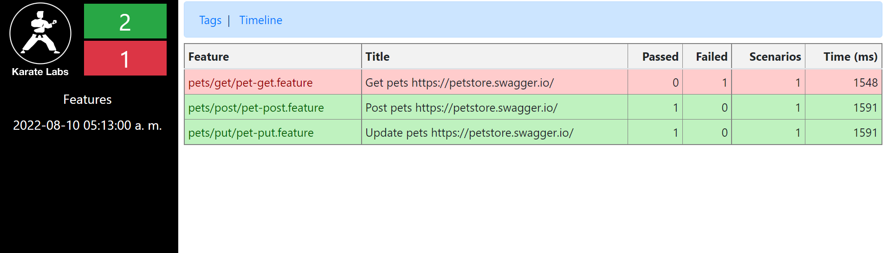

# **Prueba de apis sobre https://petstore.swagger.io/**
###### Para la prueba se utilizó Karate
###### https://github.com/karatelabs/karate

## Requisitos:
+ Java JDK 8 o superior
+ Maven 3.6
## Estructura del proyecto:
```
.
├── pom.xml
└── src
    └── test
        └── java
            ├── pets
            │   ├── get
            │   ├── post
            │   ├── put
            │   └── PetRunner.java
            ├── PetRunner.java
            └── logback-test.xml

```

Instalar dependencias y ejecutar el proyecto: 

```mvn clean install -Dtest=PetRunner```

##Reporte:
```
.
└── target
    └── karate-reports
        └── karate-summary.html

```
Ejecutar html desde un navegador. Se visualizara los features ejecutados y los resultados de los mismos


